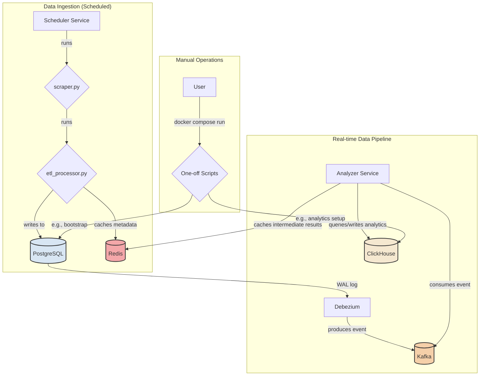
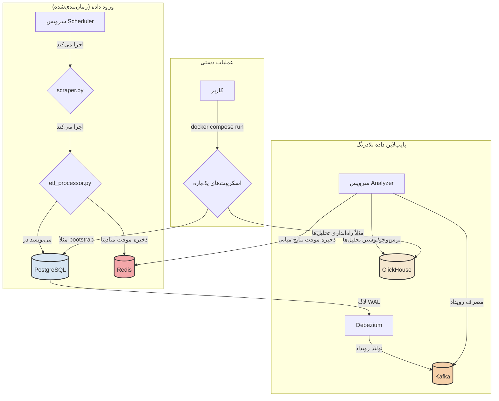

# FX-Cortex: Project Architecture

Welcome to the technical architecture documentation for FX-Cortex. This document provides a high-level overview of the system's components and the data flow between them. Our architecture is designed to be a scalable, reliable, and real-time event-driven data pipeline.

---

## Core Philosophy

The system is built on a **decoupled, event-driven architecture**. Components for data collection are completely separate from data analysis components. The system reacts to data changes in real time, not on fixed schedules. By leveraging distributed systems like Kafka, PostgreSQL, ClickHouse, and Redis, the architecture ensures scalability, fault tolerance, and efficient data processing.

---

## System Components

The system is orchestrated using `Docker Compose` with independent services communicating over a shared network.



### Detailed Component Breakdown

* **db (PostgreSQL)**: The primary data store with logical replication enabled for Debezium to monitor transaction logs. It stores raw and transformed data from the ETL process.
* **zookeeper & kafka**: Kafka is a scalable, fault-tolerant message broker decoupling data producers and consumers, enabling real-time event streaming.
* **debezium**: A Change Data Capture (CDC) engine that streams database changes from PostgreSQL to Kafka as JSON events.
* **scheduler**: Executes scheduled tasks to ingest data periodically via `scraper.py` and `etl_processor.py`.
* **analyzer**: A real-time processor consuming Kafka messages for analytics and ML inference, storing results in ClickHouse and caching intermediates in Redis.
* **redis**: A high-performance in-memory cache used to store temporary metadata during ETL and intermediate results during analysis to reduce database load.
* **clickhouse**: A columnar database optimized for analytical queries, used by the analyzer for storing and querying large-scale analytics and ML outputs.
* **app**: A general-purpose container for manual operations, such as running one-off scripts for bootstrapping or maintenance.

---

### End-to-End Data Flow

1. **Data Ingestion**: The Scheduler triggers `scraper.py` to fetch raw data from external sources.
2. **ETL Process**: `scraper.py` passes data to `etl_processor.py`, which cleans, transforms, and loads it into PostgreSQL. Metadata (e.g., timestamps or processing states) is cached in Redis for efficiency.
3. **Change Data Capture**: Debezium detects changes in PostgreSQL via Write-Ahead Logging (WAL) and converts each row change into a JSON event.
4. **Event Production**: Debezium publishes these events to Kafka topics.
5. **Real-time Consumption**: The Analyzer consumes Kafka messages in near real-time, processes them for analytics or ML inference, and caches intermediate results in Redis.
6. **Analysis and Storage**: The Analyzer stores final analytics outputs (e.g., aggregated metrics or ML predictions) in ClickHouse for efficient querying and reporting.

---

### How to Run the System

1. **Prerequisites**: Install Docker and Docker Compose.
2. **Configuration**: Clone the repository and create `.env` from `.env.example`, ensuring all required environment variables (e.g., `DB_NAME`, `DB_USER`, `DB_PASSWORD`, `REDIS_HOST`, `CLICKHOUSE_HOST`) are set.
3. **Build**:
```bash
docker compose build app
```
4. **Start Services**:
```bash
docker compose up -d
```
5. **Activate Debezium Connector**:
```bash
curl -i -X POST -H "Accept:application/json" -H "Content-Type:application/json" localhost:8083/connectors/ -d @pg-connector.json
```
6. **Monitor**:
```bash
docker compose logs -f analyzer
```

---

# FX-Cortex: معماری پروژه

به مستندات معماری فنی FX-Cortex خوش آمدید. این سند نمایی کلی از اجزای سیستم و جریان داده بین آن‌ها ارائه می‌دهد. معماری ما به گونه‌ای طراحی شده است که یک پایپ‌لاین داده‌ای مقیاس‌پذیر، قابل‌اعتماد و رویدادمحور در زمان واقعی باشد.

---

## فلسفه اصلی

سیستم بر اساس **معماری غیرهمبسته و رویدادمحور** ساخته شده است. اجزای جمع‌آوری داده کاملاً از اجزای تحلیل داده جدا هستند. سیستم به تغییرات داده به‌صورت بلادرنگ واکنش نشان می‌دهد و به برنامه‌های زمانی ثابت وابسته نیست. استفاده از سیستم‌های توزیع‌شده مانند Kafka، PostgreSQL، ClickHouse و Redis مقیاس‌پذیری، تحمل خطا و پردازش کارآمد داده را تضمین می‌کند.

---

## اجزای سیستم

کل سیستم با استفاده از `Docker Compose` ارکستره شده و شامل چندین سرویس مستقل است که روی یک شبکه مشترک با هم ارتباط دارند.



### توضیح جزئیات اجزا

* **db (PostgreSQL)**: مخزن داده اصلی با فعال‌سازی تکثیر منطقی برای مانیتورینگ لاگ‌های تراکنش توسط Debezium. داده‌های خام و تبدیل‌شده از فرآیند ETL در این دیتابیس ذخیره می‌شوند.
* **zookeeper & kafka**: Kafka یک پیام‌رسان مقیاس‌پذیر و مقاوم در برابر خطا است که تولیدکنندگان و مصرف‌کنندگان داده را از هم جدا می‌کند و استریم رویدادهای بلادرنگ را ممکن می‌سازد.
* **debezium**: موتور دریافت تغییرات داده (CDC) که تغییرات دیتابیس PostgreSQL را به‌صورت JSON به Kafka استریم می‌کند.
* **scheduler**: وظایف زمان‌بندی‌شده را برای ورود دوره‌ای داده از طریق `scraper.py` و `etl_processor.py` اجرا می‌کند.
* **analyzer**: پردازشگر بلادرنگ که پیام‌های Kafka را برای تحلیل و استنتاج مدل‌های یادگیری ماشین مصرف می‌کند، نتایج را در ClickHouse ذخیره و داده‌های میانی را در Redis کش می‌کند.
* **redis**: یک کش پرسرعت در حافظه که برای ذخیره موقت متادیتا در طول فرآیند ETL و نتایج میانی در تحلیل‌ها استفاده می‌شود تا بار روی دیتابیس‌ها کاهش یابد.
* **clickhouse**: یک دیتابیس ستونی بهینه‌شده برای پرس‌وجوهای تحلیلی که توسط Analyzer برای ذخیره و پرس‌وجوی تحلیل‌های بزرگ‌مقیاس و خروجی‌های ML استفاده می‌شود.
* **app**: کانتینر چندمنظوره برای عملیات دستی مانند اجرای اسکریپت‌های یک‌باره برای بوت‌استرپ یا نگهداری.

---

### جریان داده از ابتدا تا انتها

1. **ورود داده**: سرویس Scheduler اسکریپت `scraper.py` را برای دریافت داده‌های خام از منابع خارجی اجرا می‌کند.
2. **فرآیند ETL**: اسکریپت `scraper.py` داده‌ها را به `etl_processor.py` می‌فرستد که آن‌ها را پاک‌سازی، تبدیل و در PostgreSQL بارگذاری می‌کند. متادیتا (مانند زمان‌بندی یا وضعیت پردازش) در Redis کش می‌شود.
3. **دریافت تغییرات داده**: Debezium تغییرات PostgreSQL را از طریق لاگ‌های WAL تشخیص می‌دهد و هر تغییر ردیف را به یک رویداد JSON تبدیل می‌کند.
4. **تولید رویداد**: Debezium این رویدادها را به تاپیک‌های Kafka منتشر می‌کند.
5. **مصرف بلادرنگ**: سرویس Analyzer پیام‌ها را از Kafka در کسری از ثانیه دریافت و برای تحلیل یا استنتاج ML پردازش می‌کند، ضمن اینکه نتایج میانی را در Redis کش می‌کند.
6. **تحلیل و ذخیره‌سازی**: Analyzer خروجی‌های نهایی تحلیل (مانند متریک‌های تجمیعی یا پیش‌بینی‌های ML) را در ClickHouse برای پرس‌وجو و گزارش‌گیری کارآمد ذخیره می‌کند.

---

### نحوه اجرای سیستم

1. **پیش‌نیازها**: نصب Docker و Docker Compose.
2. **پیکربندی**: کلون کردن مخزن و ساخت فایل `.env` از روی `.env.example` با تنظیم متغیرهای لازم (مانند `DB_NAME`، `DB_USER`، `DB_PASSWORD`، `REDIS_HOST`، `CLICKHOUSE_HOST`).
3. **ساخت ایمیج**:
```bash
docker compose build app
```
4. **شروع سرویس‌ها**:
```bash
docker compose up -d
```
5. **فعال‌سازی کانکتور Debezium**:
```bash
curl -i -X POST -H "Accept:application/json" -H "Content-Type:application/json" localhost:8083/connectors/ -d @pg-connector.json
```
6. **مانیتور کردن**:
```bash
docker compose logs -f analyzer
```